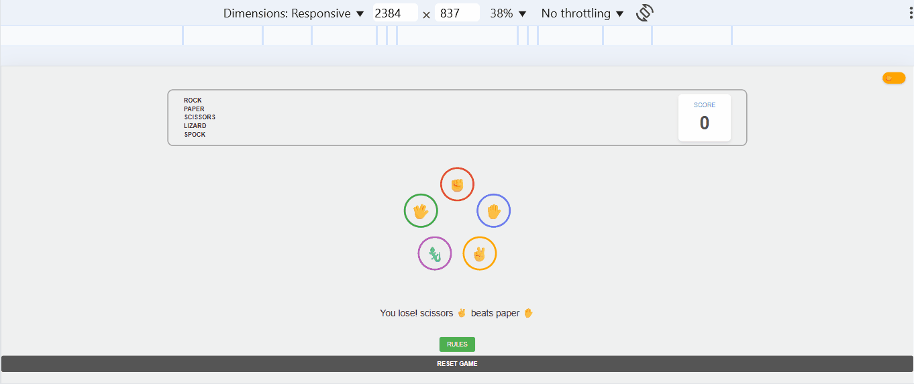

✊✋✌️ **Rock Paper Scissors Game**

---

✨ **Overview**
This project is a classic Rock Paper Scissors game built using vanilla HTML, CSS, and JavaScript. It provides a simple and interactive experience where players can challenge the computer in this timeless hand game.
I developed this game as a foundational exercise to solidify my understanding of core JavaScript logic, DOM manipulation, and event handling, which are essential skills for any web developer.

---

🚀 **Features**

Player vs. Computer: Play against an AI opponent.
Interactive Choices: Select your move (Rock, Paper, or Scissors) with intuitive buttons/images.
Real-time Results: Instantly see the outcome of each round (Win, Lose, or Draw).
Score Tracking: Keeps track of both player and computer scores.
Reset Game: Option to clear scores and start a new game.

📸 **Demo**

🛠️ **Technologies Used**
HTML5: For structuring the game's interface.
CSS3: For styling the game elements and layout.
JavaScript (Vanilla JS): The core programming language for game logic, user interaction, and DOM manipulation.

---

💻 **How to Run Locally**

Follow these simple steps to get a local copy of the game up and running on your machine.

#**Prerequisites**
You only need a modern web browser to run this game.

#**Installation**
Clone the repository:
Bash

git clone https://github.com/Sarahpiri/rock-paper-scissors.git
Navigate into the project directory:
Bash

cd rock-paper-scissors
Running the Game
Open index.html: Simply open the index.html file directly in your web browser. You can do this by double-clicking the file in your file explorer, or by dragging and dropping it into your browser window.

---

💡 **What I Learned**

Developing this Rock Paper Scissors game was an excellent opportunity to reinforce fundamental web development concepts. Here are some key takeaways:
DOM Manipulation: Gained practical experience in dynamically updating HTML elements (like scores and messages) using JavaScript.
Event Handling: Mastered attaching event listeners to user interface elements (e.g., button clicks) to trigger game logic.
Conditional Logic & Game Rules: Implemented complex if/else statements to determine win/lose/draw conditions based on player and computer choices.
Random Number Generation: Utilized JavaScript's Math.random() to simulate the computer's unpredictable moves.
Basic Game State Management: Learned to track and update the game's state, including scores and round outcomes.
Function Organization: Practiced structuring code into reusable functions for better maintainability and readability.

📞 **Contact**

Sarahpiri992@gmail.com

(https://www.linkedin.com/in/sarah-piri-5147132bb/)

Project Link:(https://rock-paper-scissors-eta-nine.vercel.app/)

